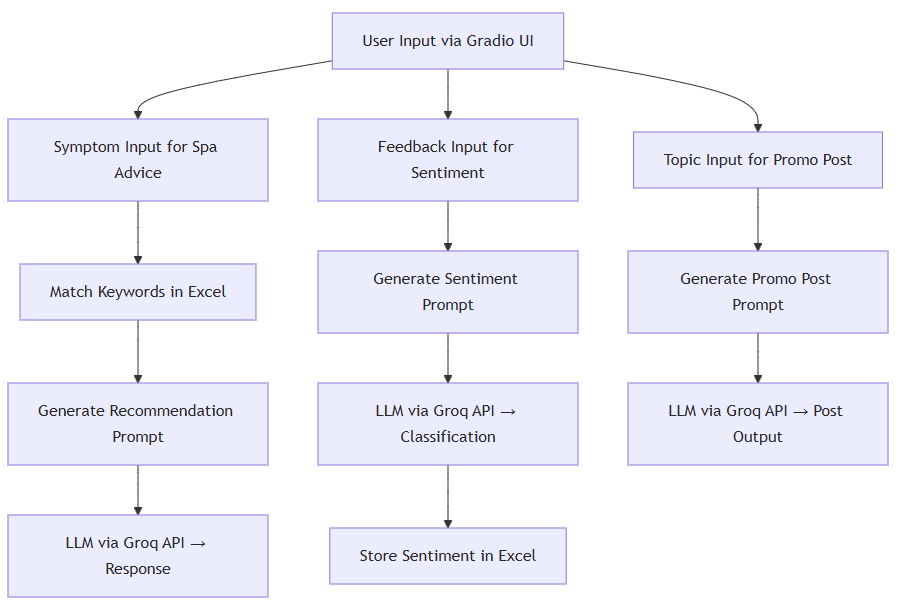

# 💆‍♀️ MySpa AI Chatbot & Marketing Tools

## 📌 Project Overview

This project is an AI-powered solution for spa businesses, combining **three practical tools**:
1. **AI Chatbot** for service recommendations based on user symptoms or emotional needs.
2. **Content Generator** for promotional posts using Generative AI.
3. **Sentiment Analyzer** to summarize and classify customer reviews from feedback.

The project leverages **Large Language Models (LLMs)**, such as **LLaMA3 via Groq API**, and is developed in **Python using Gradio for the web UI**. It’s aimed at demonstrating how AI can enhance customer interaction, automate marketing, and improve service feedback in spa businesses.

---

## 🧱 System Architecture


---

## 🚀 How to Use

### 🧠 1. Spa Recommendation Chatbot
- Go to the **"Spa Recommend"** tab.
- Type in symptoms like `"Back pain"` or `"Feeling stressed"`.
- The bot returns a **personalized service package** with name, duration, price, and benefits.
- Works in both **Thai and English**.

### 🗣 2. Customer Feedback Sentiment
- Go to the **"Customer Feedback"** tab.
- Enter user feedback like `"I loved the massage"`.
- The AI classifies sentiment as **positive**, **negative**, or **neutral**, and saves it in `/SpaProject/result_spa_sentiment.xlsx` on your Google Drive.

### 📢 3. AI Content Generator
- Go to the **"AI Post Generator"** tab.
- Select a topic (e.g., `"Monthly Promotion"`).
- The AI will generate a **ready-to-use Facebook/Line OA post** with emojis, hashtags, and catchy text (in Thai).

---

## 🔍 Prompt & Logic Explanation

| Feature                  | Prompt/Logic Summary |
|--------------------------|----------------------|
| **Spa Bot**              | Matches user symptoms to keywords in Excel, selects the best matching package, and creates a customized response prompt for the LLM. |
| **Feedback Sentiment**   | A direct prompt to classify a sentence into *positive/negative/neutral* and logs results in Excel. |
| **Post Generator**       | Uses Thai-language marketing-style prompt to simulate a professional Facebook postwriter with markdown output. |

---

## 🌟 Highlights & AI Features

- ✅ **LLM-Based NLP**: Uses **Groq LLaMA3 API** for natural, human-like responses.
- ✅ **Multi-language Support**: Smart language detection to respond in Thai or English.
- ✅ **Excel Integration**: Reads keywords and writes sentiment logs automatically via `pandas`.
- ✅ **Gradio Web UI**: No setup needed—fully interactive interface for demo or production use.
- ✅ **Practical Use Cases**: Easy to customize for real spa businesses or marketing teams.

---

## 📂 Folder & File Structure

```
MySpa/
│
├── spa_services_withkeywords.xlsx   # Service list with keywords (Thai & English)
├── result_spa_sentiment.xlsx        # Auto-generated feedback log (saved to Drive)
├── myspa_chatbot_sentiment_prj_py.py # Main source code
└── README.md                        # This file
```
